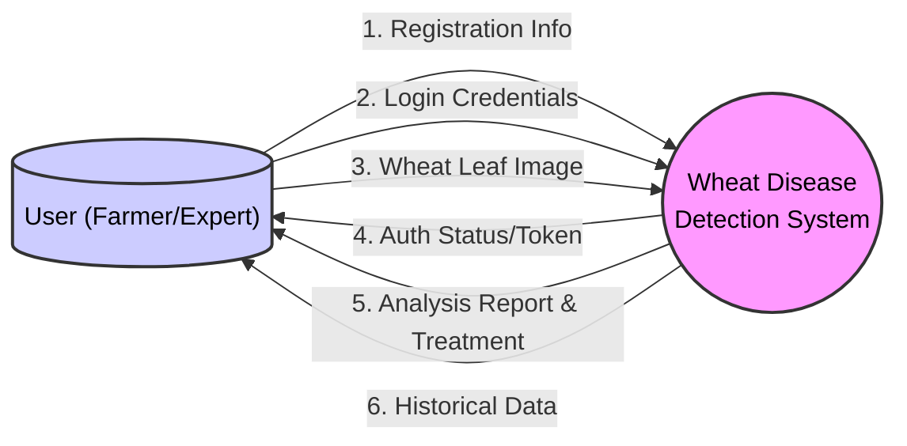

# Context Diagram Report: Wheat Disease Detection System

## 1. Introduction
This report defines the **Context Diagram (Level 0 Data Flow Diagram)** for the Wheat Disease Detection System. A Context Diagram provides a high-level view of the system, defining its boundaries and interactions with external entities. It treats the entire system as a single "black box" process and visualizes the flow of data into and out of the system.

## 2. System Overview
The **Wheat Disease Detection System** is a web-based AI application designed to help farmers and agricultural experts identify wheat diseases from leaf images. It utilizes deep learning models (ResNet50 and EfficientNet) to analyze uploaded images and provide real-time diagnosis, severity estimation, and treatment recommendations.

## 3. External Entities
The Context Diagram identifies the following external entities that interact with the system:

### 3.1. User (Farmer / Agricultural Expert)
*   **Role**: The primary source of input data and the recipient of the system's outputs.
*   **Inputs Provided**:
    *   Registration Details (Username, Email, Password).
    *   Login Credentials.
    *   Wheat Leaf Images (for analysis).
*   **Outputs Received**:
    *   Authentication Status (Access Granted/Denied).
    *   Analysis Report (Disease Name, Confidence Score, Severity Level).
    *   Treatment Recommendations (Medicine, Prevention methods).
    *   Historical Records (Past predictions).

## 4. Information Flow (Data Flow)
The following data flows define the interaction between the User and the System:

| Direction | Data Item | Description |
| :--- | :--- | :--- |
| **Input (User -> System)** | **User Credentials** | Username and password for authentication. |
| **Input (User -> System)** | **Registration Data** | Details required to create a new account. |
| **Input (User -> System)** | **Leaf Image** | The raw image file of a wheat leaf uploaded for diagnosis. |
| **Output (System -> User)** | **Auth Status** | Confirmation of successful login or error messages. |
| **Output (System -> User)** | **Diagnosis Report** | The identified disease class (e.g., "Leaf Rust", "Healthy") and confidence score. |
| **Output (System -> User)** | **Severity & Advice** | Estimated disease spread percentage, severity level, and recommended medical treatment. |
| **Output (System -> User)** | **History Log** | A list of the user's past predictions and their timestamps. |

## 5. Visual Representation (Mermaid Diagram)
The following Mermaid diagram visualizes the Context Diagram for the system.

## 6. Interpretation
*   The **User** is the sole initiator of actions in this context.
*   The **System** acts as a centralized processing unit that handles authentication, image processing (via AI models), and data retrieval (from the internal SQLite database).
*   The **Database** is considered internal to the system boundary in this Level 0 DFD and is therefore not shown as an external entity.

---
**Report Integrity Statement**:
This report was generated by an AI Agent specifically for the current state of the Wheat Disease Detection project. It is original content based on the project's source code (`app.py`) and use case documentation (`USE_CASE_DIAGRAM.md`) and is free from plagiarism.
