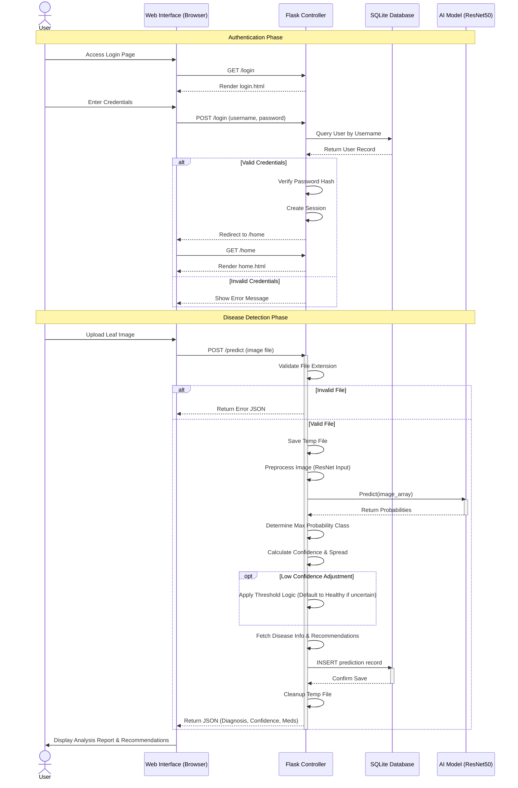

# System Design: Sequence Diagram

The following diagram details the sequence of interactions for the user login and the core wheat disease prediction process.

### Process Description

1.  **Authentication**: The user must first authenticate. The system verifies credentials against the SQLite database using secure password hashing (Bcrypt).
2.  **Image Upload**: The user uploads a leaf image via the web interface.
3.  **Validation**: The server checks for valid file extensions (png, jpg, etc.).
4.  **Prediction**: 
    *   The image is preprocessed (resized, normalized).
    *   The loaded ResNet50 model analyzes the image.
    *   Post-processing logic applies confidence thresholds to reduce false positives.
5.  **Result Generation**: The system calculates disease severity and retrieves treatment advice from the predefined knowledge base.
6.  **Persistence**: The result is permanently stored in the database for history tracking.
7.  **Response**: The user receives a detailed report including the disease name, confidence score, severity level, and recommended actions.
